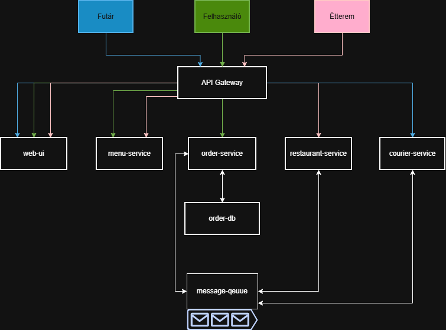

# Skálázható szoftverek - Nagy házi feladat

## Követelmény specifikáció

Egy ételrendelő rendszert fogok megvalósítani. A rendszer lehetővé teszi a végfelhasználók számára az étel házhozrendelésést, a futároknak a megbízások elfogadását és az éttermeknek saját kinálatuk meghirdetését.

* A éttermek frissíthetik a nálunk rendelhető tételek listáját és ezek árát.
* A éttermek frissíthetik a beérkező rendelések státuszát (készítés alatt, csomagolás alatt, futárra vár).
* A felhasználó megtekintheti az éttermeket és a menüjüket.
* A felhasználó feladhat egy rendelést egy adott étteremnek, ami egy vagy több tételből áll.
* A felhasználó megtekintheti a rendelése státuszát.
* A futárok megtekinthetnek és elfogadhatnak kiszállításra váró megrendeléseket.
* A rendszer teszteléséhez virutális felhasználók, éttermek és futárok szimulálják a felhasználások leadását és teljesítését.

## Architektúra és technológiák

### Az alkalmazás komponensekre/szolgáltatásokra bontásának elve

A szolgáltatások konténerizált mikroszolgáltatásokként lesznek megvalósítva on-premise kubernetes környezetben.

A szolgáltatások vágása elsősorban felhasználói történeteken alapul: felhasználó oldali megrendelési funkciók, éttermeknek elérhető funkciók, futároknak elérhető funkciók, általános termékekkel kapcsolatos funkciók. A megrendeléseket kezelő szolgáltatások üzenetsoron keresztül kommunikálnak a laza csatolás érdekében.

Az felhasználóknak, az éttermeknek és a futároknak egy közös, nagyon minimalista frontend alkalmazás készül, amely API Gateway-en keresztül kommunikál a backend szolgáltatásokkal.

### A komponensek listája, rövid leírása és technológiái a következők:

<table>
    <tr>
        <th>Szolgáltatás</th>
        <th>Technológia</th>
        <th>Leírás</th>
        <th>Indoklás</th>
    </tr>
    <tr>
        <td>web-ui</td>
        <td>Vue.js</td>
        <td>Minimális webalkalmazás, amin keresztül az éttermek, futárok és megrendelők a saját use-case-eiket elérik. Nagyon minimális lesz a GUI, ezért elégséges egy container a frontend ellátásra.</td>
        <td>Nagyon minimális lesz a frontend és nincs sok tapasztalatom a frontend frameworkökkel, ezért a Vue.js-t válaszottam, ami állítólag nagyon könnyen tanulható.</td>
    </tr>
    <tr>
        <td>menu-serivce</td>
        <td>JS</td>
        <td>Ez a szolgáltatás a menüelemek felvételére-módosítására (éttermek) és böngészésére (rendelők) szolgál. A menüelemek nem perzisztálódnak, csak a memóriában tárolódnak.</td>
        <td>Valószínűleg a Fastify JS könyvtárat fogom használni, hogy meggyorsítsam az API készítést.</td>
    </tr>
    <tr>
        <td>order-service</td>
        <td>JS</td>
        <td>Ez a szolgáltatás a rendelések felvételére szolgál a felhasználóknak. Validálja a rendelések helyességét és üzeneteket ír az üzenetsorba az új rendelésekkel kapcsolatban. A rendelések egy MondogDB adatbáziba perzisztálódnak.</td>
        <td>Valószínűleg a Fastify JS könyvtárat fogom használni, hogy meggyorsítsam az API készítést. A JS MongoDB-vel is jól működik együtt.</td>
    </tr>
    <tr>
        <td>restaurant-service</td>
        <td>JS</td>
        <td>Éttermek megtekinthetik a hozzájuk bejövő rendeléseket, és frissíthetik a rendelések státuszát. Ez a szolgáltatás üzeneteket fogyasz az üzenetsorból az új rendelésekkel kapcsolatban és új üzeneteket tesz közzé az állapotuk firssülésével kacspolatban.</td>
        <td>Valószínűleg a Fastify JS könyvtárat fogom használni, hogy meggyorsítsam az API készítést.</td>
    </tr>
    <tr>
        <td>courier-service</td>
        <td>JS</td>
        <td>A futárok megtekinthetik az elérhető kiszállításokat és elfogadhatják őket. Ez a szolgáltatás üzeneteket fogyaszt az üzenetsorból az elérhető kiszállításokkal kapcsolatban és új üzeneteket tesz közzé ezek elfogadásáról.</td>
        <td>Valószínűleg a Fastify JS könyvtárat fogom használni, hogy meggyorsítsam az API készítést.</td>
    </tr>
    <tr>
        <td>order-db</td>
        <td>MongoDB</td>
        <td>MongoDB NoSQL adatbázis a megrendelések adatainak tárolásához.</td>
        <td>Valószínűleg a Fastify JS könyvtárat fogom használni, hogy meggyorsítsam az API készítést.</td>
    </tr>
    <tr>
        <td>aszinkron üzenetsor</td>
        <td>RabbitMQ</td>
        <td>Aszinkron üzenetsor a megrendelések kezelésére.</td>
        <td>Még nem dolgoztam üzenetsorokkal, és a tárgynál több helyen ez szerepelt. Könnyen használhatónak tűnik.</td>
    </tr>
    <tr>
        <td>API Gateway</td>
        <td>Traefik</td>
        <td>Az alkalmazás publikus belépési pontjai a frontend felől.</td>
        <td>Kb. mint az üzenetsornál.</td>
    </tr>
    <tr>
        <td>virtual-customer</td>
        <td>Python</td>
        <td>Ütemezetten szimulálja a rendelés létrehozását.</td>
        <td>Úgy gondolom, hogy könnyen meg lehet valósítani Pythonnal.</td>
    </tr>
    <tr>
        <td>virtual-restaurant</td>
        <td>Python</td>
        <td>Ütemezetten szimulálja a rendelés teljesítését.</td>
        <td>Úgy gondolom, hogy könnyen meg lehet valósítani Pythonnal.</td>
    </tr>
    <tr>
        <td>virtual-courier</td>
        <td>Python</td>
        <td>Ütemezetten szimulálja a kiszállítások teljesítését.</td>
        <td>Úgy gondolom, hogy könnyen meg lehet valósítani Pythonnal.</td>
    </tr>
</table>

### Az alkalmazás logikai architektúra ábrája

